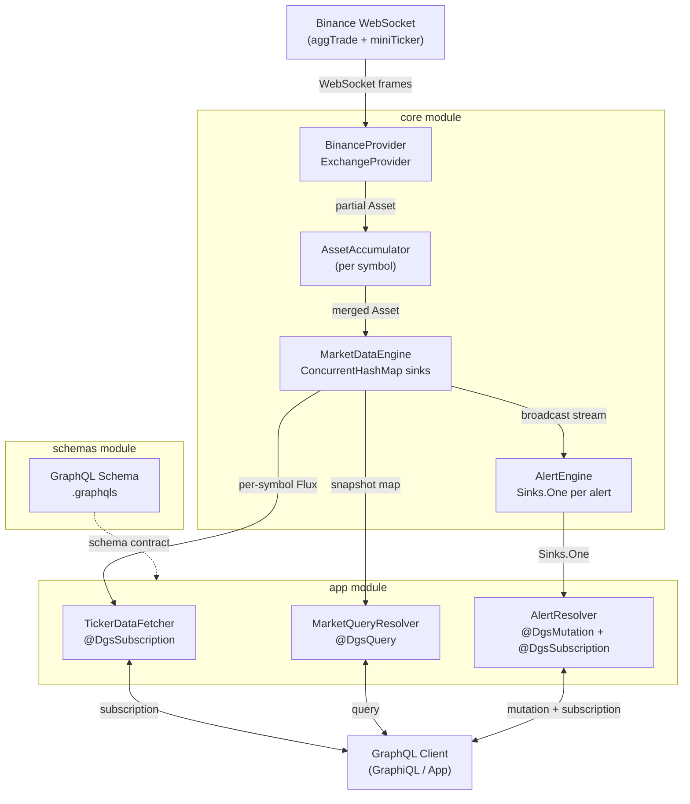
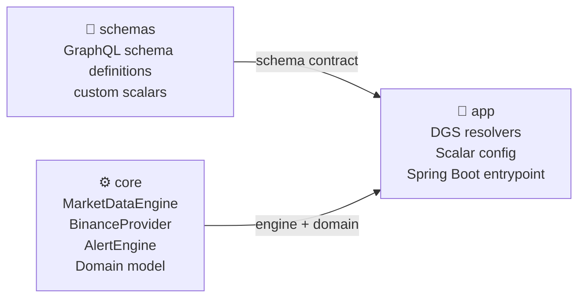
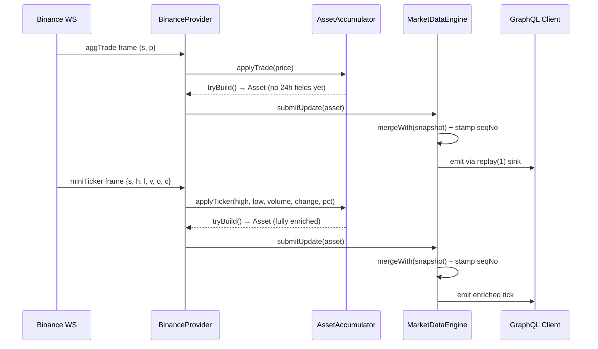
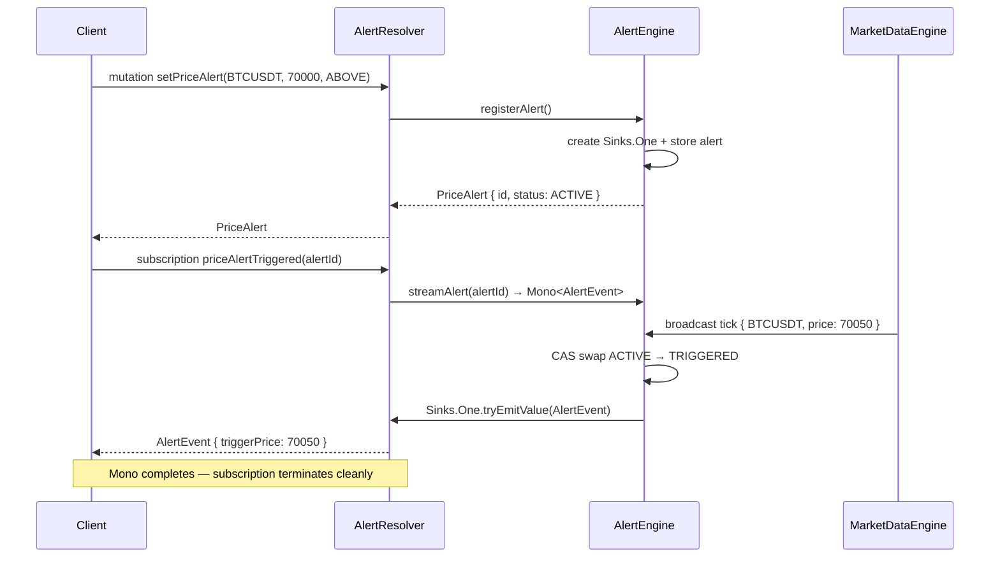
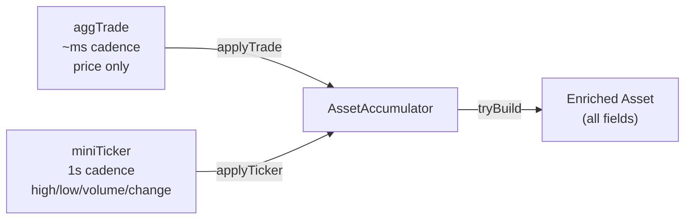

# coro-ticker

A high-concurrency, real-time market data engine built on Spring Boot WebFlux and Netflix DGS,
streaming live cryptocurrency prices from Binance over GraphQL subscriptions.
This project was made to learn about netflix's dgs and graphql.

---

## Architecture Overview



---

## Module Structure



| Module    | Responsibility |
|-----------|---------------|
| `schemas` | GraphQL schema files, custom scalar declarations (`DateTime`, `BigDecimal`) |
| `core`    | Domain model, market data engine, Binance WebSocket provider, alert engine |
| `app`     | DGS resolvers wiring core to GraphQL, Spring Boot startup |

---

## Data Flow

### Live Tick Ingestion



### Alert Lifecycle



---

## Key Design Decisions

### Per-symbol `replay(1)` sinks

Every symbol has its own `Sinks.Many` with `replay().latest()`. A client subscribing mid-stream receives the last known price immediately — no waiting for the next Binance tick.

```
BINANCE:BTCUSDT  →  Sinks.Many (replay 1)  →  Flux<Asset>
BINANCE:ETHUSDT  →  Sinks.Many (replay 1)  →  Flux<Asset>
BINANCE:SOLUSDT  →  Sinks.Many (replay 1)  →  Flux<Asset>
```

### Dual-stream accumulation

Binance's `aggTrade` fires on every individual trade (~milliseconds). `miniTicker` fires every second with 24h stats. These are merged per-symbol in `AssetAccumulator` before reaching the engine, with `mergeWith()` preserving fields across partial updates.



### Exactly-once alert firing

`AlertEngine.evaluate()` uses `ConcurrentHashMap.replace()` as a compare-and-swap to atomically flip an alert from `ACTIVE` to `TRIGGERED`. Only the thread that wins the swap fires the `Sinks.One` — concurrent ticks on the same symbol cannot double-fire an alert.

---

## GraphQL API

### Queries

```graphql
# Snapshot of last known prices — O(1) map lookup, no subscription needed
query {
  latestPrices(exchange: "BINANCE", symbols: ["BTCUSDT", "ETHUSDT"]) {
    symbol
    currentPrice
    change24h
    changePct24h
    high24h
    low24h
    volume24h
    seqNo
    lastUpdated
  }
}

# What the engine is currently tracking
query {
  trackedSymbols {
    symbol
    exchange
    subscribers
  }
}
```

### Subscription

```graphql
# Live tick stream — replay(1) delivers last price immediately on connect
subscription {
  marketTicks(exchange: "BINANCE", symbols: ["BTCUSDT"]) {
    symbol
    currentPrice
    changePct24h
    seqNo
    lastUpdated
  }
}
```

### Alert lifecycle

```graphql
# 1. Create
mutation {
  setPriceAlert(input: {
    symbol: "BTCUSDT"
    targetPrice: 70000
    direction: ABOVE
  }) { id status createdAt }
}

# 2. Watch — completes automatically when triggered
subscription {
  priceAlertTriggered(alertId: "...") {
    triggerPrice
    triggeredAt
    alert { status triggeredAt }
  }
}

# 3. Cancel
mutation {
  cancelPriceAlert(alertId: "...")
}
```

---

## Tech Stack

| Layer | Technology |
|-------|-----------|
| Runtime | Java 21, Spring Boot 4.x |
| Reactive | Project Reactor (`Flux`, `Mono`, `Sinks`) |
| Web | Spring WebFlux, Reactor Netty |
| GraphQL | Netflix DGS 11, graphql-java 25, Spring GraphQL |
| WebSocket | Reactor Netty WebSocket client |
| Observability | Micrometer + Spring Boot Actuator |
| Build | Maven multi-module |

---

## Getting Started

**Prerequisites:** Java 21, Maven 3.9+

```bash
# Clone and build
git clone https://github.com/riken127/coro-ticker.git
cd coro-ticker
mvn clean install

# Run
cd app
mvn spring-boot:run
```

GraphiQL is available at **`http://localhost:8080/graphiql`** once the app starts. The Binance WebSocket connects automatically on startup — you should see symbols registering in the logs within a few seconds.

```
[Binance] Connected — streams: btcusdt@aggTrade/btcusdt@miniTicker/...
[Engine]  New symbol registered: BINANCE:BTCUSDT
[Engine]  New symbol registered: BINANCE:ETHUSDT
```

### Configuring tracked symbols

Edit `core/src/main/resources/application.yaml`:

```yaml
binance:
  symbols:
    - BTCUSDT
    - ETHUSDT
    - SOLUSDT
    - BNBUSDT
    - XRPUSDT
```

---

## Observability

Actuator is available at `http://localhost:8080/actuator`. Key Micrometer metrics:

| Metric | Description |
|--------|-------------|
| `market.active_symbols` | Number of symbols with an active sink |
| `market.broadcast.subscribers` | Clients on the all-symbols stream |
| `market.updates.total` | Tick counter tagged by `symbol` and `exchange` |
| `binance.ws.connected` | 1 when WebSocket is live, 0 on disconnect |
| `binance.ws.reconnects` | Cumulative reconnect counter |
| `binance.parse.errors` | Skipped unparseable frames |
| `alerts.active` | Currently active price alerts |
| `alerts.registered` | Cumulative alerts created |
| `alerts.triggered` | Cumulative alerts fired |
| `alerts.cancelled` | Cumulative alerts cancelled |

---

## Roadmap

- [ ] Alert persistence (Redis / Postgres) — survive restarts
- [ ] Auth scoping — bind alerts to authenticated users via Spring Security
- [ ] DGS codegen — generate `PriceAlertInput` and other types from schema
- [ ] Additional exchanges — implement `ExchangeProvider` for Coinbase, Kraken
- [ ] `seqNo` gap detection — client-side utility for detecting missed ticks